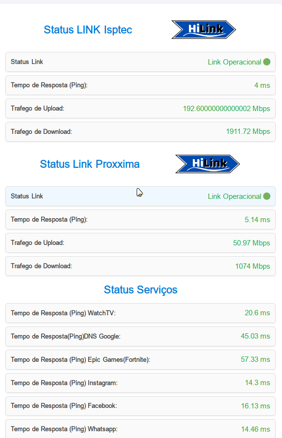

# Página de Status - Monitoramento com Zabbix e Node.js

## 📌 Sobre o Projeto
Este projeto consiste em uma página de status que exibe informações de conectividade, como ping, taxa de upload e download, coletadas a partir da API do Zabbix. O backend foi desenvolvido em Node.js puro (sem bibliotecas adicionais como Express) e fornece uma API para consulta dos dados.

---

## 🚀 Tecnologias Utilizadas
- **Node.js** (HTTP nativo)
- **JavaScript** (Frontend e Backend)
- **HTML & CSS** (Interface da Página de Status)
- **Zabbix API** (Coleta de métricas)

---

## 📂 Estrutura do Projeto
```
public
├── img
│   └── hilink.png
├── index.html
└── scripts
    └── status.js
src
├── server.js
└── services
    └── get-data-api-zabbix.js

```

---

## ⚙️ Instalação e Configuração
### 1️⃣ Pré-requisitos
Antes de iniciar, certifique-se de ter instalado:
- **Node.js** (versão 16 ou superior)
- **Zabbix configurado** com as permissões adequadas

### 2️⃣ Configuração do Ambiente
Crie um arquivo `.env` na raiz do projeto e adicione suas credenciais do Zabbix:
```
ZABBIX_URL=http://seu-servidor-zabbix/api_jsonrpc.php
ZABBIX_USER=seu_usuario
ZABBIX_PASSWORD=sua_senha
```

### 3️⃣ Executando o Servidor
Para iniciar o servidor, execute:
```sh
node server.js
```
O servidor estará disponível em: `http://localhost:2828/`

---

## 📡 Endpoints da API
### 🔹 Rota Principal (Página de Status)
```http
GET /
```
Retorna a página HTML de status.

### 🔹 Dados de Monitoramento
```http
GET /status/borda
```
Retorna os dados coletados do Zabbix em formato JSON:
```json
{
  "Download": "50 Mbps",
  "Upload": "20 Mbps",
  "Ping": "10 ms"
}
```
## Status Screen 


---

## 🛠️ Melhorias Futuras
- ✅ Melhorar a interface da página de status
- ✅ Adicionar gráficos de histórico de desempenho
- ✅ Implementar autenticação na API

---

## 📝 Licença
Este projeto está sob a licença MIT. Sinta-se livre para contribuir!


